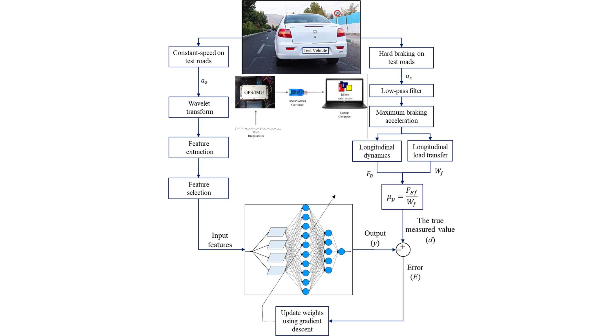

# Data-driven-Maximum-Tire-Road-friction-Coefficient-Prediction



## Overview
This project develops an algorithm to predict maximum TRFC using a multi-layer perceptron neural network, trained on features from vertical accelerations due to road characteristics. Data was collected through vehicle tests on selected roads, measuring vertical acceleration and using wavelet transform to extract the four most significant features. Ground-truth TRFC data was obtained from hard braking maneuvers. This study provides a TRFC estimation even during constant-speed driving conditions. For more detailed information, please read this [paper](https://link.springer.com/article/10.1007/s40430-022-03631-7))

## Features
- The measurement data for one single road test is provided.
- The road test corresponds to three hard-braking maneuvers on a road with a high friction coefficient.
- The friction coefficient of the road is measured from the maximum braking longitudinal acceleration before ABS activation.

## Installation
To get started, follow these steps:

**Clone the repository**:
    ```sh
    git clone https://github.com/AliMMSadeghi/Data-driven-Maximum-Tire-Road-Friction-Coefficient-Prediction.git
    ```
## Usage
To run the main file for the project, use the following command in MATLAB:

```matlab
ALLTOXYZ.m

and select the "coarse-output_2020-12-18_15-21-19.xls" file.
